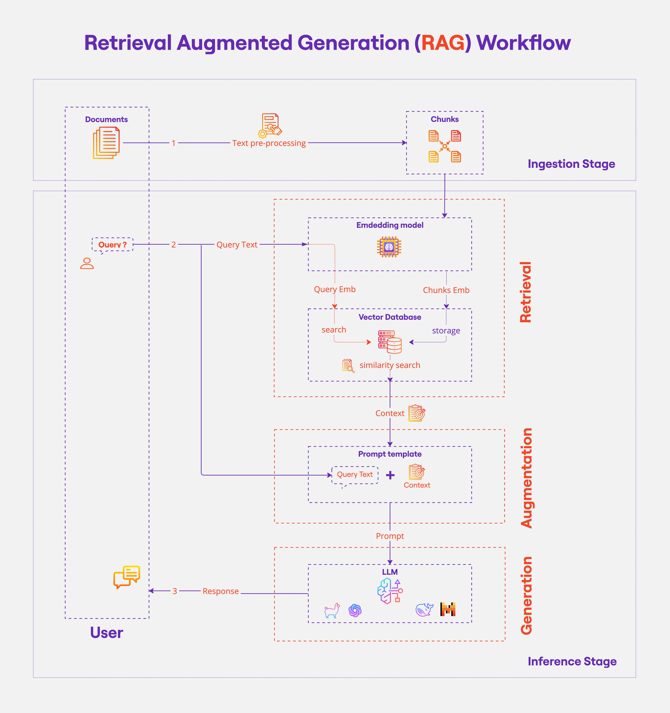

[](https://github.com/neuefische/ds-rag-pipline/actions/workflows/workflow-02.yml)

## Retrieval Augmented Generation (RAG) with LangChain 

This lesson shows how with LangChain framework one could perform Retrieval Augmented Generation, i.e., augment a Large Language Model with document retrieval. 
There are two parallel notebooks: 
- `llama_rag` shows the use of compltely open-source Huggingface and Llmma models
- `openai_rag` shows the use of OpenAI models

Either notebook requires credentials to be loaded from a `.env` file, which should contain respectively either of the following lines, if not both:
```
GROQ_API_KEY=<your groq api key>
OPENAI_API_KEY=<your openai api key>
```

- [Groq API Key](https://console.groq.com/playground) can be generated and used free of charge
- [OpenAI API Key]((https://platform.openai.com/docs/api-reference/introduction)) requires a credit card to be generated and is subject to billing

## Environment

### **`macOS`** type the following commands : 


- Install the virtual environment and the required packages by following commands:

    ```BASH
    pyenv local 3.11.3
    python -m venv .venv
    source .venv/bin/activate
    pip install --upgrade pip
    pip install -r requirements.txt
    ```
### **`WindowsOS`** type the following commands :

- Install the virtual environment and the required packages by following commands.

   For `PowerShell` CLI :

    ```PowerShell
    pyenv local 3.11.3
    python -m venv .venv
    .venv\Scripts\Activate.ps1
    python -m pip install --upgrade pip
    pip install -r requirements.txt
    ```

    For `Git-Bash` CLI :
    ```
    pyenv local 3.11.3
    python -m venv .venv
    source .venv/Scripts/activate
    python -m pip install --upgrade pip
    pip install -r requirements.txt
    ```

    
